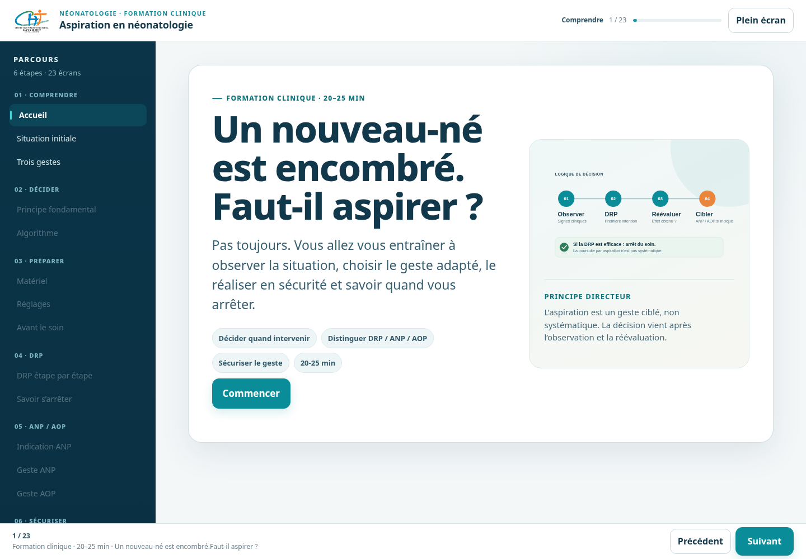

# Aspiration en néonatologie — version web v2

Formation clinique interactive destinée à une publication web/GitHub avant packaging SCORM pour Moodle.

## Utilisation

Aucune compilation n’est nécessaire. Le site est statique :

- `index.html` : parcours principal ;
- `assets/style.css` : design system et responsive ;
- `assets/app.js` : navigation, interactions, reprise locale et évaluation ;
- `assets/tracking.js` : adaptateur de suivi web, prévu pour être remplacé/étendu au moment du packaging SCORM ;
- `assets/*.svg` : schémas pédagogiques ;
- `resources/` : protocole, fiche réflexe et matrice de couverture.

## Publication GitHub Pages

1. Décompresser le ZIP à la racine d’un dépôt GitHub.
2. Conserver `index.html` à la racine.
3. Dans GitHub : **Settings → Pages**.
4. Choisir la branche de publication et le dossier racine `/`.

Le parcours ne dépend d’aucune bibliothèque externe ni d’aucune police distante.

## Suivi dans cette version

La progression est conservée sur l’appareil via `localStorage`. Le futur packaging SCORM pourra conserver la même interface de suivi en remplaçant l’adaptateur `assets/tracking.js`.

## Validation métier avant diffusion apprenant

Voir `VALIDATION_METIER.md`. Trois formulations du protocole restent à confirmer : « souris » pour la DRP, « EPPI » pour l’AOP et la cohérence « bébé intubé » / « bébé intubé et sédaté ».

## Revue design

Voir `DESIGN_REVIEW.md` pour l’audit UX/UI et `CHANGES_EXACT.patch` pour le différentiel de code complet par rapport à la v1.
